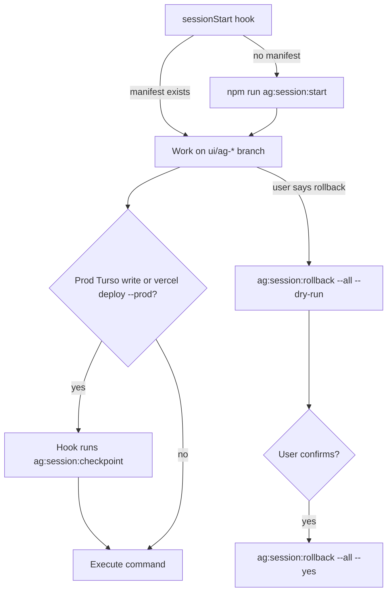

# AG Safe Session — 에이전트용 전체 흐름

사람용 요약: [ag-safe-session.md](./ag-safe-session.md)  
사후 수동 복구: [ag-postmortem-2026-05-21.md](./ag-postmortem-2026-05-21.md)

---

## 한 장 요약



| 레이어 | 복구 단위 | 도구 |
|--------|-----------|------|
| 코드 | Git tag / branch | `ag:session:rollback --code` |
| DB | Turso export 또는 PIT branch | `ag:session:rollback --db` |
| Vercel | deployment URL | `ag:session:rollback --deploy` |

---

## 자동화 (Cursor — 이 레포)

| 시점 | 동작 |
|------|------|
| Cursor **세션 시작** | `.ag-session.json` 없으면 → `npm run ag:session:start -- cursor-auto` |
| **위험 shell** 직전 | `REAL_DATA_RUN_ACK`, `seed_*`, `vercel deploy --prod` 등 → `checkpointed` 아니면 **`ag:session:checkpoint` 자동 실행** |

설정: [`.cursor/hooks.json`](../../.cursor/hooks.json), 규칙: [`.cursor/rules/ag-safe-session.mdc`](../../.cursor/rules/ag-safe-session.mdc)

**Antigravity만 쓸 때:** Cursor 훅이 없을 수 있음 → 아래 **프롬프트**로 동일 절차를 지시.

---

## 에이전트 체크리스트 (매 세션)

1. **시작** — manifest 확인 (`npm run ag:session:status`). 없으면 `npm run ag:session:start`.
2. **작업** — `ui/ag-*` 브랜치에서만 코드 수정. `main` 금지.
3. **위험 작업** — prod Turso / prod deploy 전 checkpoint (훅이 없으면 직접 `ag:session:checkpoint`).
4. **롤백** — 사용자가 원상복구 요청 시:
   - `npm run ag:session:rollback -- --all --dry-run`
   - 결과 보고 후 `--yes` (사용자 확인 필수)
   - 부분 `git checkout origin/main -- <file>` **금지**

---

## 위험 명령 (checkpoint 필요)

- `REAL_DATA_RUN_ACK=I_ACK_PROD_WRITE` + `scripts/seed_*.py`, `update_dividends.py`, …
- `npx vercel deploy --prod`
- `turso db import` (복구 포함) — 프로덕션 DB 데이터 일괄 교체
- `turso db execute` — 프로덕션 DB 직접 SQL 실행 (단일 쿼리도 포함)
- `turso db shell` — 프로덕션 DB 대화형 접속 (세션 중 임의 쓰기 가능)

`DRY_RUN=1`, `npm run build`, `npm run dev` → checkpoint 불필요.

---

## 롤백 상세

```bash
npm run ag:session:rollback -- --all --dry-run   # 계획만
npm run ag:session:rollback -- --code --yes      # Git만
npm run ag:session:rollback -- --db --yes        # Turso (파괴적 — import/branch)
npm run ag:session:rollback -- --deploy --yes    # Vercel
```

Turso `--db` 후 URL이 바뀔 수 있음 → Vercel `TURSO_DATABASE_URL` 확인.

---

## 금지 (incident 기반)

- browser MCP로 Vercel/AWS 시크릿·Build Command 조작
- `main`에 직접 commit/push
- 체크포인트 없이 prod re-seed로 “복구”
- 서브에이전트 “복구 완료” 맹신 — CLI/스크린샷 검증

---

## 사용자에게 보낼 프롬프트 모음

→ [ag-prompts-ko.md](./ag-prompts-ko.md)
