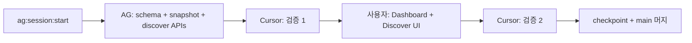

# GSF-Investor 고도화 설계서 (v2 — 코드베이스 정합)

> **작성일**: 2026-05-21  
> **상태**: 구현용 **정본** (v1 대체)  
> **v1**: [2026-05-21-investor-upgrade-design.md](./2026-05-21-investor-upgrade-design.md) — 초안; 스키마·cron 가정이 코드와 불일치  
> **타임라인**: 1~2주 (Impact-First, **델타 구현**)  
> **디자인**: Koyfin (밀도) + Simply Wall St (시각) + Empower (순자산 추이) + TradingView (차트 UX)  
> **톤**: Economist 타이포·컬러 유지 (`economist-ui`, Editorial 차트)

---

## 0. v2에서 바뀐 핵심

| v1 가정 | v2 (코드 기준) |
|---------|----------------|
| `wealth_snapshots`, `wealth_entries` | **`net_worth_snapshots`**, **`wealth_positions`** |
| `portfolio_holdings` | **`trade_journal` + `v_portfolio` 뷰** |
| `portfolio_snapshots` 신규 | **`holding_snapshots`** (레거시 `portfolio_snapshots` 명칭 사용 금지) |
| `exchange_rates` 신규 + ExchangeRate-API | **테이블·USDKRW 적재 이미 존재** (`daily_price.py`) |
| `users.base_currency` | **`user_preferences` 단일 행** (1인 NextAuth) |
| Discover·대시보드 전면 신규 | **기능 상당 부분 존재 → UX·데이터 갭만 확장** |
| Vercel cron 3개 신규 | **Actions Python + 기존 `net-worth-snapshot` API** 우선 |
| `yahoo-finance2` (Node) | **Python `daily_price` + `data_provider`** |

---

## 1. 배경·목표

GSF-Portfolio 통합 이후 Investor는 **주식 포트폴리오 + 전체 순자산**을 한 앱에서 본다.

### 1.1 현재 갭 (검증됨)

| 니즈 | 상태 |
|------|------|
| 순자산·자산 클래스 **시간 추이 UI** | `net_worth_snapshots` cron 있음, **대시보드 차트 없음** |
| 보유 종목 **일별 평가 스냅샷** | 실시간 `v_portfolio`만 있음, **히스토리 테이블 없음** |
| 스크리너·**다종목 비교** | 프리셋·스코어보드·레이더 있음, **필터 UX·compare URL 없음** |
| 벤치마크 오버레이 | **069500 Alpha**만 있음, 포트폴리오 차트 오버레이 없음 |
| 배당 캘린더 | `prices.dividend`만 있음, **ex/pay 일정 없음** |
| 기준 통화 Settings | API에서 USDKRW 환산만, **표시 통화 선택 없음** |

### 1.2 사용 패턴

- **1인 우선** (`ALLOWED_EMAIL`), 가족 공유는 Phase 3+
- 주식 분석·매매 일지가 핵심; `/wealth`는 정적·저빈도 갱신

### 1.3 비목표 (이번 2주)

- 멀티 테넌트 `user_id` 전 테이블 확장
- 일본(TYO) 거래소·`stocks.exchange` 대규모 마스터 확장
- 업종 평균 대비 레이더 (섹터 벤치마크 DB 없음) — Phase 3

---

## 2. 현행 베이스라인 (2026-05-21)

### 2.1 스키마 (Drizzle — `src/db/schema.ts`)

| 테이블 | 용도 |
|--------|------|
| `stocks`, `financials`, `prices`, `disclosures`, `signals` | 종목·재무·시세·공시·시그널 |
| `trade_journal` | 매매·INIT (포지션 정본) |
| `reports`, `stock_notes`, `signal_rules`, `stock_loans` | AI 보고서·메모·규칙·담보대출 |
| `wealth_positions` | 비주식 자산·부채 |
| `net_worth_snapshots` | 순자산 일별 스냅샷 |
| `exchange_rates` | `pair` (예: `USDKRW`), `date`, `rate` |

**뷰:** `v_portfolio` — `trade_journal` 집계 (`scripts/db-views.mjs`, `create_views.py`)

### 2.2 라우트 (App Router)

| 경로 | 비고 |
|------|------|
| `/` | 포트폴리오 대시보드 — KPI·4차트·보유 테이블·Alpha(069500) |
| `/wealth` | 순자산·`wealth_positions` |
| `/discover` | 목록 + **AI 스코어보드** (레이더·프리셋) |
| `/stocks/[ticker]`, `/journal`, `/signals`, `/reports`, `/settings`, `/disclosures` | 기존 |
| `/login` | NextAuth Google + dev preview |

### 2.3 이미 있는 Discover·대시보드

- **Discover:** `screening-presets.ts`, `/api/discover/all-scores`, `DiscoverScoreboard` + `RadarChart`
- **밸류에이션:** `valuation-metrics.ts` — FY PER/PBR, ROE (`financials` + `prices`)
- **대시보드:** `computeNetWorth()` 링크, `benchmarkReturn` / `alpha` vs ticker `069500`

### 2.4 Cron·배치 (현행)

| 작업 | 구현 |
|------|------|
| 일별 종가·USDKRW | GitHub Actions → `scripts/daily_price.py` |
| DART/SEC/시그널 | `daily_dart.yml`, `daily_sec.yml`, `weekly_signal.yml` |
| 순자산 스냅샷 | Vercel `GET /api/cron/net-worth-snapshot` → `net_worth_snapshots` |
| 벤치마크 ETF | `scripts/add_benchmark.py` (069500) |

### 2.5 운영 필수 (구현 시 준수)

- [AG Safe Session](../operations/ag-safe-session.md) — prod Turso/deploy 전 checkpoint
- [실데이터 수동 검증](../operations/real-data-manual-validation.md), [재무 검증](../operations/financial-data-validation.md)
- `scripts/real_data_guard.py` — 원격 쓰기·manifest 게이트

---

## 3. 실행 계획 (재조정)

### 3.1 원칙

1. **데이터·cron 먼저** (UI가 읽을 스냅샷 확보)
2. **전면 리디자인 금지** — 기존 `DashboardClient`·`DiscoverScoreboard` **확장**
3. **단일 환율 소스** — v2 Week 1은 `daily_price` Yahoo FX 유지; JPY는 Week 2

### 3.2 일정

| 주차 | 목표 | 산출물 |
|------|------|--------|
| **Week 1** | 추이 데이터 + Discover MVP | `holding_snapshots` + cron, `/` 넷워스 Area, discover 필터 API + `?compare=`, 문서·검증 |
| **Week 2** | 성과·설정·선택 기능 | 포트폴리오 수익률 차트, 벤치마크 정책, `user_preferences`, `/dividends` **(데이터 준비 시)**, 차트 UX 폴리싱 |

### 3.3 완료 정의 (공통)

- [ ] `npm run build` 성공
- [ ] `npm run db:generate` + migrate (또는 `db:wealth-schema` 패턴) 적용 문서화
- [ ] prod 반영 전 `ag:session:checkpoint` + 수동 검증 체크리스트 1회
- [ ] 빈 스냅샷·빈 가격 시 empty state

---

## 4. 데이터 인프라

### 4.1 신규·변경 스키마 (Drizzle)

```ts
// holding_snapshots — 일별 보유 평가 (portfolio_snapshots 이름 사용 금지)
export const holdingSnapshots = sqliteTable(
  "holding_snapshots",
  {
    id: integer("id").primaryKey({ autoIncrement: true }),
    stockId: integer("stock_id").references(() => stocks.id).notNull(),
    date: text("date").notNull(), // YYYY-MM-DD
    quantity: real("quantity").notNull(),
    avgPrice: real("avg_price").notNull(),
    marketPrice: real("market_price"),
    marketValueKrw: real("market_value_krw"),
    unrealizedPnlKrw: real("unrealized_pnl_krw"),
    currency: text("currency").default("KRW"),
    createdAt: text("created_at").default(sql`(datetime('now'))`),
  },
  (t) => [uniqueIndex("uq_holding_snapshots").on(t.stockId, t.date)]
);

// user_preferences — 1인 앱 단일 행 (id=1)
export const userPreferences = sqliteTable("user_preferences", {
  id: integer("id").primaryKey(), // always 1
  baseCurrency: text("base_currency").default("KRW"), // KRW | USD | JPY
  updatedAt: text("updated_at").default(sql`(datetime('now'))`),
});
```

**변경 없음 (그대로 사용):**

- `net_worth_snapshots` — 순자산 추이
- `exchange_rates` — `pair` + `date` + `rate` (v1의 base/quote 컬럼으로 마이그레이션하지 않음)
- `wealth_positions` — 비주식 잔고 정본

**Phase 2b (배당 캘린더 선행):**

```ts
// dividend_events — 적재 파이프라인 확정 후
export const dividendEvents = sqliteTable(
  "dividend_events",
  {
    id: integer("id").primaryKey({ autoIncrement: true }),
    stockId: integer("stock_id").references(() => stocks.id).notNull(),
    exDate: text("ex_date"),
    payDate: text("pay_date"),
    amountPerShare: real("amount_per_share"),
    currency: text("currency").default("KRW"),
    source: text("source"),
    fetchedAt: text("fetched_at").default(sql`(datetime('now'))`),
  },
  (t) => [uniqueIndex("uq_dividend_events").on(t.stockId, t.exDate, t.payDate)]
);
```

### 4.2 스냅샷·집계 로직

**`holding_snapshots` (신규 cron/script)**

1. `v_portfolio` + 당일 `prices` 최신 종가 JOIN
2. USD 포지션 → `exchange_rates` USDKRW로 `market_value_krw` 환산
3. `INSERT OR REPLACE` per `(stock_id, date)`

**`net_worth_snapshots` (기존)**

- 유지: `/api/cron/net-worth-snapshot` + `computeNetWorth()`
- UI: `breakdown_json` 파싱해 Stacked Area 세그먼트 (주식/비주식/부채 등)

### 4.3 Cron·배치 (v2)

| 작업 | 주기 | 구현 위치 | 비고 |
|------|------|-----------|------|
| 순자산 스냅샷 | 주 1회 (금 18:00 KST 권장) | **기존** `/api/cron/net-worth-snapshot` | Vercel Cron 또는 Actions curl |
| 보유 일별 스냅샷 | 평일 18:00 KST | **신규** `scripts/holding_snapshot.py` + Actions workflow | `REAL_DATA_RUN_ACK` on prod |
| 종가·USDKRW | 평일 07:00 KST | **기존** `daily_price.yml` | ExchangeRate-API **추가하지 않음** (Week 2 JPY 검토) |
| 벤치마크 가격 | daily_price에 포함 또는 종목 시드 | **기존 패턴** `069500` in `stocks`/`prices` | ^KS11/^GSPC는 **정책 결정 후** (§6.2) |

**신규 Vercel cron은 Week 1 필수 아님** — Actions로 통일하면 운영 단순.

### 4.4 환율 정책

| 통화 | Week 1 | Week 2 |
|------|--------|--------|
| USD/KRW | `daily_price` → `exchange_rates` (`USDKRW`) | 동일 |
| JPY/KRW | 미표시 또는 고정 placeholder | `daily_price`에 `JPYKRW` pair 추가 **또는** ExchangeRate-API 1회/일 |

**금지:** USDKRW를 Yahoo와 ExchangeRate-API가 동시에 덮어쓰기.

---

## 5. `/discover` — 델타 설계

### 5.1 유지 (재구현 금지)

- 탭: 관심종목 목록 + AI 스코어보드
- 프리셋: balanced / value / growth / dividend
- `/api/discover/all-scores` + 레이더 (6축 체크리스트)

### 5.2 Week 1 추가

**A. 서버사이드 스크리너 API**

`GET /api/discover/screen?market=KR&sector=...&perMin=&perMax=...&held=only|exclude|all`

| 필터 | 소스 | Week 1 | Week 2 |
|------|------|--------|--------|
| PER, PBR | `valuation-metrics` + latest price | ✅ | |
| ROE, 영업이익률 | `financials` FY | ✅ | |
| 배당수익률 | `dividend_per_share / price` (컬럼 없음) | ✅ | |
| 매출/EPS YoY | `financials` 2기 FY | | ✅ (데이터 품질 확인 후) |
| 1M/3M/6M/1Y 수익률 | `prices` | | ✅ |
| 52주 고점 대비 | `prices` 252일 | | ✅ |
| 시장 | `stocks.market` (`KR`/`US`) | ✅ | |
| 거래소 KRX/NYSE/TYO | `stocks.exchange` | | Phase 3 |
| 보유 필터 | `v_portfolio` JOIN | ✅ | |

**B. 결과 UI**

- 정렬 가능 테이블 (기존 스코어보드와 통합 또는 서브탭 「스크리너」)
- 행 체크박스 → 최대 5종목

**C. 비교 모드** `/discover?compare=005930,000660,...`

- 비교 테이블 (PER, PBR, ROE, 배당수익률)
- 정규화 가격 라인 (1M/3M/6M/1Y) — `GET /api/discover/compare-prices?ticker=...&range=`
- 재무 바: 기존 `StockCharts` 패턴 재사용
- 레이더: 스코어보드 점수 재사용 (업종 평균 **미사용**, 프리셋 점수 0–100)

### 5.3 레이더 (v2 점수 — Phase 1)

| 축 | 지표 | 산정 |
|---|------|------|
| 밸류에이션 | PER, PBR | 기존 `scorePer` / `scorePbr` |
| 성장성 | — | Week 2 YoY 추가 전 「중립 50」 또는 항목 축소 |
| 수익성 | ROE, 부채비율 | `scoreDebtRatio` + ROE from `computeRoe` |
| 배당 | 배당 연속 연수 | `scoreDividendYears` |
| 안정성 | 52주 변동성 | Week 2 |

---

## 6. `/` 대시보드 — 델타 설계

### 6.1 유지

- KPI 스트립: 총 평가, 수익률, Alpha(069500), Core/Sat, USD/KRW
- 차트 4종: 수익률 바, Core/Sat 도넛, 비중·섹터 도넛
- 보유 테이블, 담보대출, 시그널 링크
- subtitle 순자산 링크 → `/wealth`

### 6.2 Week 1 추가

**① 넷워스 추이 (Empower)**

- 데이터: `net_worth_snapshots` (`net_worth`, `securities_krw`, `wealth_assets_krw`, `breakdown_json`)
- Stacked Area — `big_category` 또는 breakdown 키별
- 기간: `[1M][3M][6M][1Y][ALL]`
- 스냅샷 &lt; 2건이면 CTA: 「스냅샷 cron 확인」

**② 히어로 카드 (선택적 축소)**

- v1의 3칸 카드 중 **「오늘 손익」**은 전일 스냅샷 필요 → Week 2 또는 `holding_snapshots` 2일치 이후
- Week 1: **총 평가·순자산·누적 수익률**만 KPI 스트립 정리 (기존 KPI 재배치)

**⑤ 활동 타임라인 (Week 2)**

- UNION: `trade_journal` + `disclosures` (+ `dividend_events` when ready)
- 최근 10건, 아이콘·한 줄 요약

### 6.3 Week 2 — 포트폴리오 성과

- **P&L 테이블:** 기존 보유 테이블 강화 (정렬·필터) — **별도 페이지 불필요** unless UX 혼잡
- **수익률 라인:** `holding_snapshots` 합산 일별 `SUM(market_value_krw)` vs cost
- **비중 도넛:** 기존 `WeightDonut` + 섹터 토글 유지

### 6.4 벤치마크 정책 (결정 필요)

| 옵션 | 설명 |
|------|------|
| **A (권장 Week 2)** | 기존 **069500** 라인만 포트폴리오 수익률 차트에 오버레이 |
| B | `^KS11`, `^GSPC`를 `stocks` 벤치마크 행으로 `daily_price` 확장 |
| C | 시장별 자동 (^KS11 if any KR holding) |

Alpha KPI는 옵션 A와 일관.

---

## 7. Week 2 — 배당·설정

### 7.1 `/dividends` (조건부)

**선행:** `dividend_events` 적재 스크립트 + 1회 prod seed 검증

- 캘린더 뷰: `ex_date`, `pay_date`
- 리스트·월별/연간 요약
- 보유 종목 필터 (`v_portfolio`)

데이터 소스 미확정 시 **Week 2에서 UI만 mock → Phase 2b로 연기** 명시.

### 7.2 기준 통화 (`user_preferences`)

- `/settings` 드롭다운: KRW / USD / JPY
- `formatMoney(amountKrw, baseCurrency)` 헬퍼 — `exchange_rates` 최신 pair 사용
- 적용 범위 Week 2: 히어로·P&L 테이블·`/wealth` (차트 축은 Week 2 말 또는 Phase 3)

---

## 8. 비주얼·차트 (v1 §7 계승, 범위 조정)

- **원칙·팔레트:** v1 §7 그대로 (`--color-equity` 등 `globals.css`에 점진 추가)
- **Recharts 유지**; 크로스헤어·기간 버튼은 **신규 차트 컴포넌트에만** Week 2 적용
- **종목 상세** `/stocks/[ticker]`: 레이더는 Discover와 중복 — 상세에는 **링크 「스코어보드에서 보기」** 우선, 인라인 레이더는 Week 2 optional

---

## 9. 기술 결정 (수정)

| 항목 | 결정 | 이유 |
|------|------|------|
| 차트 | Recharts | 전역 사용 중 |
| ORM | Drizzle | `schema.ts` 단일 정본 |
| 환율 Week 1 | Yahoo via `daily_price.py` | 이미 `exchange_rates` 적재 |
| 환율 JPY | Week 2 — `daily_price` 확장 우선 | 이중 소스 방지 |
| 벤치마크 | `prices` + `stocks` (069500) | `page.tsx` Alpha 로직 존재 |
| 보유 스냅샷 | Python script + GHA | `real_data_guard`·기존 Actions 패턴 |
| 순자산 스냅샷 | Vercel API route 유지 | 이미 Telegram 알림 연동 |
| 인증 | NextAuth 1인 | `user_preferences.id = 1` 하드코드 허용 |

---

## 10. 라우트·API 변경 요약

| 경로 / API | 변경 |
|------------|------|
| `/` | 넷워스 Area + (Week 2) 타임라인·수익률 라인 |
| `/discover` | 스크리너 탭 + `?compare=` |
| `/dividends` | **신규 (조건부)** |
| `/settings` | `base_currency` |
| `/wealth` | 통화 표시·도넛 폴리싱 |
| `/stocks/[ticker]` | 차트 UX 소폭 (optional) |
| `GET /api/discover/screen` | **신규** |
| `GET /api/discover/compare-prices` | **신규** |
| `GET /api/net-worth/history` | **신규** (`net_worth_snapshots`) |
| `GET /api/holdings/history` | **신규** (`holding_snapshots`) |
| `scripts/holding_snapshot.py` | **신규** |
| `.github/workflows/holding_snapshot.yml` | **신규** |
| `/api/cron/net-worth-snapshot` | 유지 (스케줄만 문서화) |

---

## 11. 구현 체크리스트

### Week 1

- [ ] Drizzle: `holding_snapshots`, (선택) migration 적용
- [ ] `holding_snapshot.py` + workflow + prod ACK 문서
- [ ] `GET /api/net-worth/history` + Dashboard Stacked Area
- [ ] Discover screen API + 테이블 UI
- [ ] `?compare=` + compare-prices API
- [ ] `ag-safe-session` checkpoint before prod migrate/seed

### Week 2

- [ ] `user_preferences` + Settings UI + format helper
- [ ] Portfolio return line from `holding_snapshots`
- [ ] Benchmark overlay (069500 policy A)
- [ ] Activity timeline
- [ ] `dividend_events` + `/dividends` **OR** 연기 문서화
- [ ] Chart UX polish (period buttons, tooltips)

### 문서·검증

- [ ] README 또는 `docs/specs/`에 cron 스케줄 표 추가
- [ ] 재무 지표 변경 시 `validate_valuation_metrics.py` 1회
- [ ] v1 설계서 상단에 v2 링크 (완료)

---

## 12. 리스크·완화

| 리스크 | 완화 |
|--------|------|
| 스냅샷 빈 데이터 | cron 실패 알림·UI empty state |
| PER/PBR 스크리너 오류 | FY-only 규칙 (`valuation-metrics`) 유지, 검증 스크립트 |
| prod Turso 오염 | AG session + `REAL_DATA_RUN_ACK` |
| 2주 일정 초과 | 배당·TYO·업종 레이더를 Phase 2b/3로 밀기 |
| v1 문서 혼동 | **구현은 v2만 참조** |

---

## 13. 작업 분담 (실행: AG · 검증: Cursor)

### 13.0 실행·검증 모델

혼동 방지: **코딩·구현은 Antigravity(AG)만** 담당하고, **Cursor 에이전트는 검증만** 담당한다. (Google Gemini 등 별도 코딩 에이전트를 구현 주체로 두지 않는다.)

| 역할 | 담당 | 하지 않는 것 |
|------|------|----------------|
| **AG (Antigravity)** | §13.2 AG 열 전부 — 스키마, Python/cron, API Routes, (협의 시) 백엔드 통합 | UI 컴포넌트·`DashboardClient`·Discover 화면(사용자 영역) |
| **Cursor (검증)** | 마일스톤마다 v2·코드·`npm run build`·가드·파일 소유권 점검 | feature 구현·대량 코딩·prod migrate 실행 |
| **사용자** | `ag:session` 승인, main 머지, prod deploy, §13.2 **사용자** 열(UI·프론트) | — |

**검증 요청 타이밍 (Cursor에게):**

1. AG 「Week 1 백엔드 완료」 보고 직후 → UI 착수 전  
2. 사용자 UI·`net-worth/history` 통합 후 → main 머지 전  
3. AG Week 2 백엔드 완료 후 / Week 2 UI 후  
4. prod Turso migrate·seed 직전  

검증 시 제공: 브랜치명, `git diff --stat`, AG 완료 체크리스트(§11) 자체 평가.

**용어:** 글로벌 규칙 파일 `GEMINI.md`는 AG가 읽는 **헌법 문서** 이름이며, 구현 주체를 뜻하지 않는다.

### 13.1 공통 규칙

| 규칙 | 내용 |
|------|------|
| 정본 | 이 문서(v2)만 구현 기준. v1 테이블명·cron 가정 **금지** |
| 브랜치 | `ui/ag-upgrade-*` 하나. **한쪽만** `npm run ag:session:start` |
| main | 직접 commit/push 금지. 머지는 PR 또는 사용자 확인 후 |
| 복구 | `ag:session:rollback`만. `git checkout origin/main -- <file>` **금지** |
| prod | migrate/seed/deploy 전 `ag:session:checkpoint` + 사용자 승인 |
| 충돌 방지 | 아래 **파일 소유권** 표 준수 — 동일 파일 동시 편집 금지 |

참고: [ag-safe-session.md](../operations/ag-safe-session.md), [ag-prompts-ko.md](../operations/ag-prompts-ko.md)

### 13.2 권장 역할

| 담당 | Week 1 | Week 2 |
|------|--------|--------|
| **AG** | `holding_snapshots` 스키마·migrate, `holding_snapshot.py`, GHA workflow, `GET /api/discover/screen`, `GET /api/discover/compare-prices`, (선택) `GET /api/holdings/history` | `user_preferences` 스키마·API, `dividend_events` + 적재 스크립트(데이터 소스 확정 시), 벤치마크 `daily_price` 확장(정책 B/C 선택 시) |
| **사용자** (UI·프론트 구현) | `GET /api/net-worth/history`, `/` Stacked Area·KPI 정리, Discover 스크리너 UI·`?compare=` 페이지 | `/settings` 통화 UI, 포트폴리오 수익률 라인·벤치 오버레이, 활동 타임라인, `/dividends` UI(데이터 있을 때), 차트 UX 폴리싱 |
| **Cursor** (검증만) | §13.0 마일스톤 검증, §11 체크리스트 대조, 회귀·가드 확인 | 코딩·스키마·API 구현 |
| **함께** | prod migrate 일정, cron 스케줄(KST), §6.4 벤치마크 A/B/C 결정 | 배당 데이터 소스·연기 여부, Week 1 회고 후 범위 조정 |

### 13.3 파일 소유권 (동시 수정 금지)

| 소유 | 경로 예시 |
|------|-----------|
| **AG** | `src/db/schema.ts` (신규 테이블만), `drizzle/*`, `scripts/holding_snapshot.py`, `.github/workflows/holding_snapshot.yml`, `src/app/api/discover/screen/`, `compare-prices/`, `src/app/api/holdings/` |
| **사용자** | `src/app/page.tsx`, `DashboardClient.tsx`, `src/components/DashboardCharts.tsx`, `src/app/discover/**`, `src/app/api/net-worth/`, `src/app/settings/**`, `src/app/dividends/**` |
| **협의 후** | `package.json` scripts, `README.md`, `AGENTS.md`, 공용 `src/lib/*` |

스키마 변경 후 사용자는 AG 커밋을 **pull/rebase 한 뒤** UI 작업을 시작한다.

### 13.4 권장 순서



1. 세션 시작(한 번) → 브랜치 공유
2. **AG**: 데이터·API 먼저 (UI가 붙을 계약 확정)
3. **Cursor**: 검증 ① — PASS 후에만 UI 착수
4. **사용자**: API 스펙·응답 JSON 확인 후 UI 구현
5. **Cursor**: 검증 ② — `npm run build`·회귀·가드
6. prod는 **사용자 승인** + `ag:session:checkpoint` 후

### 13.5 체크리스트 소유 (§11 대응)

| §11 항목 | AG (구현) | 사용자 (구현) | Cursor (검증) |
|----------|-----------|---------------|---------------|
| `holding_snapshots` + cron | ✅ | | ✅ |
| `net-worth/history` + Area | API 공유 시 AG 가능 | ✅ 기본 | ✅ |
| discover screen API | ✅ | | ✅ |
| discover screen/compare UI | | ✅ | ✅ |
| `ag:session:checkpoint` (prod) | 실행·보고 | **승인** | 절차 확인 |
| Week 2 `user_preferences` | 스키마·API ✅ | Settings UI ✅ | ✅ |
| Week 2 dividends | 파이프라인 ✅ | 페이지 ✅ | ✅ |

### 13.6 복사용 프롬프트

**AG — Week 1 백엔드만**

```
GSF-Investor 고도화 Week 1 백엔드만 담당한다.
정본: docs/specs/2026-05-21-investor-upgrade-design-v2.md §4, §5.2 Week 1, §11 Week 1, §13.
GEMINI.md §2.5 + AGENTS.md + AG Safe Session(ui/ag-*) 준수. v1 테이블명·ExchangeRate-API 신규 cron 금지.
산출: holding_snapshots(Drizzle) + scripts/holding_snapshot.py + .github/workflows/holding_snapshot.yml
      + GET /api/discover/screen + GET /api/discover/compare-prices
      + (선택) GET /api/holdings/history
UI·Dashboard·net-worth history API는 하지 않는다.
완료 시 변경 파일 목록·migrate 명령·샘플 API 응답을 보고한다. Cursor 검증 ① 전에 prod push/migrate 하지 않는다.
```

**Cursor — 검증 ① (AG Week 1 백엔드 후)**

```
AG Week 1 백엔드 완료 주장 — v2 §13.0 검증 ① 수행.
정본: docs/specs/2026-05-21-investor-upgrade-design-v2.md §4, §5.2, §11, §13.
확인: holding_snapshots·cron·discover APIs·v1 테이블명 없음·AG 파일 소유권·Dashboard 미수정.
npm run build. PASS/FAIL과 수정 지시만 보고(구현은 하지 않음).
```

**사용자 — Week 1 프론트·통합** (Cursor 검증 ① PASS 후)

```
v2 §6.2 Week 1 + §10: GET /api/net-worth/history + Dashboard Stacked Area(net_worth_snapshots)
      + Discover 스크리너 UI + /discover?compare= (AG의 screen/compare-prices API 사용).
AG 브랜치·schema 반영 후 진행. schema.ts·scripts/ 는 AG 소유 — 사용자가 직접 수정하지 않는다.
완료 후 Cursor 검증 ② 요청.
```

**Cursor — 검증 ② (Week 1 UI·통합 후)**

```
Week 1 UI 통합 완료 — v2 §13.0 검증 ②.
확인: net-worth history API·Stacked Area·discover screen/compare UI·npm run build·기존 Alpha/스코어보드 회귀.
PASS/FAIL만 보고. main 머지·prod는 사용자 승인 후.
```

**AG — Week 2 백엔드**

```
v2 §7, §11 Week 2: user_preferences + dividend_events(소스 확정 시) + 적재 스크립트.
/dividends·Settings UI·차트 폴리싱은 하지 않는다.
```

**사용자 — Week 2 UI**

```
v2 §6.3–§7, §8: Settings base_currency, portfolio return line, benchmark overlay(069500 A),
activity timeline, /dividends(UI는 dividend_events 데이터 있을 때만).
```

### 13.7 병렬 불가·직렬 구간

| 직렬 구간 | 이유 |
|-----------|------|
| UI → `holding_snapshots` 조회 | AG 스키마·migrate 선행 |
| 포트폴리오 수익률 라인(Week 2) | Week 1 cron이 2일치 이상 쌓인 후 |
| `/dividends` 실데이터 | `dividend_events` 적재 완료 후 |
| prod DB migrate | 사용자 승인 + checkpoint 단일 창구 |

Week 1에서 AG API가 지연되면 사용자는 **mock JSON·로컬 db**로 UI만 먼저 개발 가능(병렬 유지).

---

## 부록 A — v1 → v2 용어 대조

| v1 | v2 |
|----|-----|
| `wealth_snapshots` | `net_worth_snapshots` |
| `wealth_entries` | `wealth_positions` |
| `portfolio_holdings` | `v_portfolio` / `trade_journal` |
| `portfolio_snapshots` | `holding_snapshots` |
| `financials.dividend_yield` | 계산 필드 |
| `stocks.exchange` | `stocks.market` (KR/US) |
| `users.base_currency` | `user_preferences.base_currency` |

---

## 부록 B — 에이전트 작업 시

```
이 스펙은 docs/specs/2026-05-21-investor-upgrade-design-v2.md 가 정본이다.
실행: AG(Antigravity) = 코딩·구현. 검증: Cursor = 마일스톤 점검만. 사용자 = UI·prod 승인.
GEMINI.md = AG가 따를 글로벌 규칙 파일명(구현 주체 아님). 동일 파일 동시 편집 금지.
AG Safe Session(ui/ag-*), real_data_guard, v1 테이블명 사용 금지.
```
