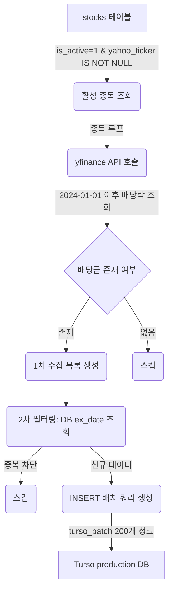

# [KI] yfinance 기반 GSF-Investor 배당 캘린더 적재 자동화 파이프라인

본 지식 항목은 GSF-Investor Phase 2b 배당 데이터 적재 및 자동화 파이프라인(`scripts/update_dividend_calendar.py`)의 구현 설계와 운영 노하우를 영구 보존하기 위해 작성되었습니다.

---

## 1. 아키텍처 및 데이터 흐름



1. **활성 종목 추출**: DB `stocks` 테이블에서 `is_active = 1` 이고 `yahoo_ticker`가 `NULL`이 아닌 대상을 추출합니다.
2. **배당 통화 매핑**: 종목의 `market`에 맞춰 배당 통화를 자동으로 매핑합니다.
   * `US` $\rightarrow$ `USD`
   * `JP` $\rightarrow$ `JPY`
   * `KR` 등 기타 $\rightarrow$ `KRW`
3. **yfinance 수집**: `yf.Ticker(yahoo_ticker).dividends` 시리즈를 활용하여 배당락일(`ex_date`)과 주당 배당액(`amount_per_share`)을 파싱합니다.
4. **배당금 지급일 처리**: yfinance API는 지급일을 신뢰성 있게 제공하지 않으므로, 데이터 정합성을 위해 지급일(`pay_date`) 필드는 **SQL NULL (`None`)**로 일관되게 적재합니다.

---

## 2. 핵심 엔지니어링 및 안전 장치

### ① 이중 중복 방지 필터링 (Deduplication Guard)
SQLite/Turso 데이터베이스에서 `uq_dividend_events` `(stock_id, ex_date, pay_date)` 복합 유니크 인덱스가 걸려있으나, SQLite에서 `NULL` 값(지급일 `pay_date`가 NULL임)이 여러 개 삽입될 때 고유성 위반으로 무시되지 않고 중복 삽입될 가능성이 있습니다. 
이를 예방하기 위해 스크립트 단에서 다음 2단계 검증을 엄격히 적용합니다:
* **1단계**: 각 종목별로 수집 단계 전, DB에서 `SELECT ex_date FROM dividend_events WHERE stock_id = ?` 쿼리를 실행해 이미 적재된 배당락일 캐시 셋(`existing_dates`)을 획득합니다.
* **2단계**: 수집된 배당 이벤트 중 `ex_date`가 캐시 셋에 속하지 않은 **순수 신규 데이터만** 메모리에서 걸러내어 `INSERT` 쿼리를 생성합니다.

### ② enforce_remote_write_guard 안전 통제
프로덕션 Turso DB에 무단으로 임의 쓰기가 발생하는 것을 방지하기 위해 `real_data_guard.py`가 통합되어 있습니다.
* 환경변수 `REAL_DATA_RUN_ACK=I_ACK_PROD_WRITE`가 설정되어야만 원격 데이터 쓰기가 승인됩니다.
* `DRY_RUN=1` 플래그를 설정하면 실제 쿼리 트랜잭션 배치는 무시되고 요약 로깅 및 시뮬레이션 결과만 안전하게 반환됩니다.

### ③ ag:session 백업 앵커와의 동기화
실제 프로덕션 Turso 쓰기 작업 바로 전에는 `npm run ag:session:checkpoint` 명령을 수동 또는 배치 전에 트리거하여 현 상태의 `.ag-session.json`과 데이터베이스 스냅샷(`backups/ag-sessions/`)을 보존하는 것이 운영 안전 제약입니다.

---

## 3. 운영 및 트러블슈팅

* **실행 명령어**:
  ```bash
  # Dry Run 시뮬레이션 검증
  DRY_RUN=1 python3 scripts/update_dividend_calendar.py

  # 프로덕션 Turso DB 실데이터 적재
  REAL_DATA_RUN_ACK=I_ACK_PROD_WRITE python3 scripts/update_dividend_calendar.py
  ```
* **데이터 검증 방법**:
  ```sql
  -- 전체 건수 확인
  SELECT COUNT(*) FROM dividend_events;

  -- 최신 배당락일 기준 top 5 조회
  SELECT d.id, s.ticker, d.ex_date, d.amount_per_share, d.currency, d.source 
  FROM dividend_events d 
  JOIN stocks s ON d.stock_id = s.id 
  ORDER BY d.ex_date DESC 
  LIMIT 5;
  ```
* **트러블슈팅**: `yfinance` 다운로드 실패 혹은 한국 종목의 분배금 누락 시, 대상 종목의 `yahoo_ticker` 문자열(`.KS`, `.KQ` 등) 포맷을 `stocks` 테이블에서 점검하십시오.
